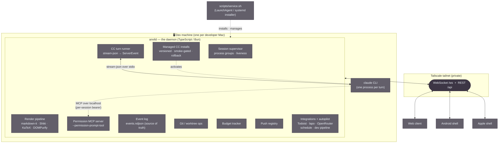
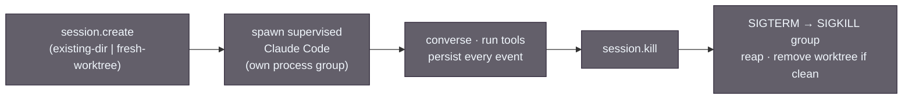
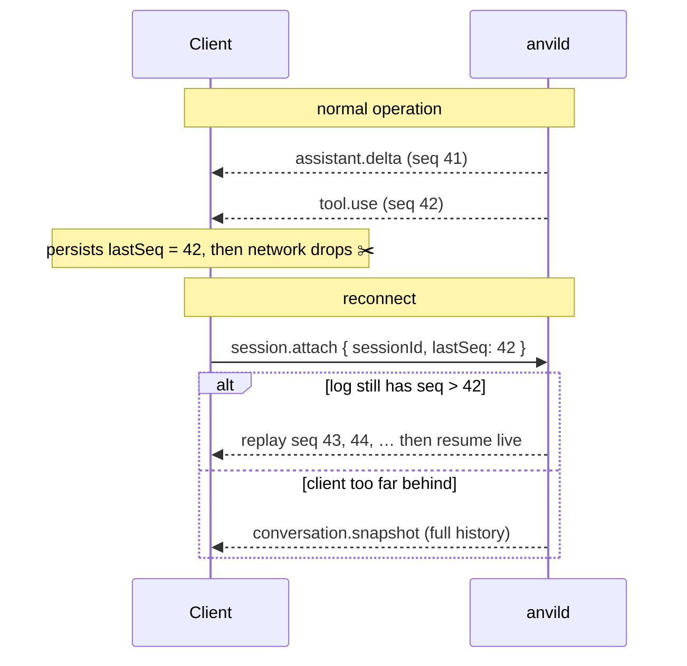
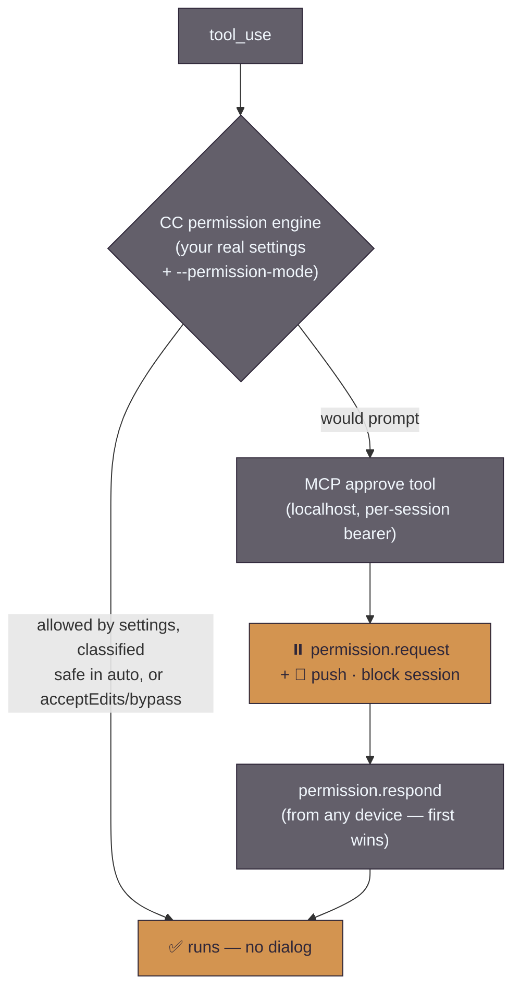
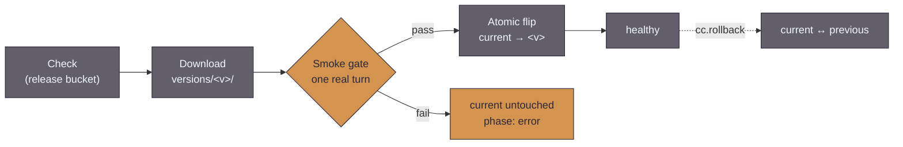
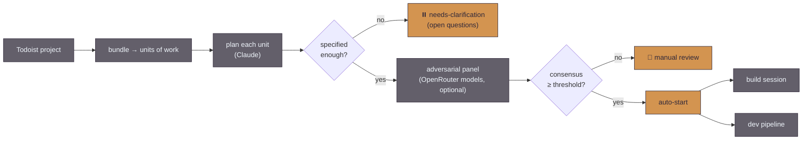
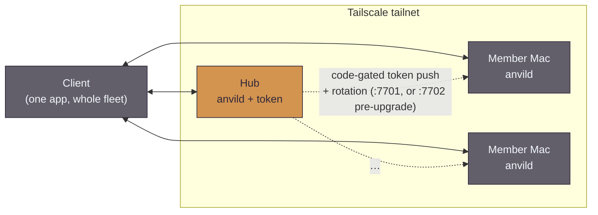

  <picture>
    <source media="(prefers-color-scheme: dark)" srcset="assets/anvil-banner-dark.svg">
    <source media="(prefers-color-scheme: light)" srcset="assets/anvil-banner-light.svg">
    
  </picture>

# Architecture

This is the approachable tour. It explains the moving parts and how they fit together,
with diagrams. For the authoritative, decision-by-decision design see
[`plans/anvil-native-architecture.md`](plans/anvil-native-architecture.md); for the exact
wire format see [`plans/anvil-protocol.ts`](plans/anvil-protocol.ts).

---

## The one big idea

Claude Code can be driven programmatically **as itself** — the real `claude` CLI, spawned
per turn with `-p --output-format stream-json --input-format stream-json`. It runs the full
agent loop and emits a *typed event stream* — assistant text deltas, `tool_use` blocks, tool
results, permission requests, usage/cost, and a final result. It also supports session
resume (`--resume`), a permission-prompt tool, and hooks.

So Anvil never scrapes a terminal. A daemon spawns the CLI and forwards **structured
events**; clients render them natively. Permission prompts become real dialogs instead of
keystrokes into a pane. Every other design choice hangs off this one.

> **This used to be the Agent SDK.** Anvil originally drove Claude Code through
> `@anthropic-ai/claude-agent-sdk`. The fork replaced that with the CLI directly
> ([`plans/2026-08-13-cc-cli-transport-design.md`](plans/2026-08-13-cc-cli-transport-design.md)),
> and the SDK dependency is gone from the lockfile. The payoff is **config authority**: an
> SDK-hosted agent ran with `settingSources: []`, a private permission engine and a private
> tool registry, so it was a *different* agent from the one in your terminal. A spawned CLI
> loads your real `~/.claude` — settings, `CLAUDE.md`, skills, plugins, hooks, and your own
> MCP servers — so the session on your phone is the session you'd get by typing `claude`.
> That is why the danger list and the autonomy engine were deleted rather than ported:
> config authority belongs to Claude Code, and a second policy layer on top of it would be a
> second, quietly-diverging answer to "is this tool call allowed?"

---

## The pieces

- **`anvild`** — the keystone. One daemon per Mac. It supervises sessions, drives the Claude
  Code CLI, renders markdown, brokers permission prompts, tracks the budget, persists an
  event log, owns the git worktrees, manages its own versioned Claude Code installs, runs
  the autopilot + adversarial pipeline and the Todoist/lapo/OpenRouter integrations, and
  serves both the web client and the protocol. Lives in [`anvild/src/`](../anvild/src/);
  everything CLI-transport-specific is under [`anvild/src/cc/`](../anvild/src/cc/).
- **Web client** — vanilla TypeScript served by the daemon at `/`. It is both the daily
  driver in a browser *and* the shared render surface bundled into the native shells.
  Lives in [`anvild/web/`](../anvild/web/).
- **Native shells** — thin [Android](../app/) (Kotlin WebView) and [Apple](../apple/)
  (SwiftUI WKWebView) apps. They host the web client and add platform-native push and
  device integration.
- **Setup & fleet** — [`scripts/service.sh`](../anvild/scripts/service.sh) does the one-time install
  (Bun, web build, LaunchAgent / systemd, `tailscale serve`); the Claude login and joining a fleet
  happen in the browser on every platform.

---

## Sessions and their lifecycle

A **session** is the unit of work: one conversation against one working tree. The daemon
owns the lifecycle explicitly — there are no Zellij sockets or husks to reason about.

| Field | Meaning |
|---|---|
| `source` | `existing-dir` (attach to a directory as-is) or `fresh-worktree` (spin up a git worktree off a base branch) |
| `model` | `opus` (default) · `sonnet` · `haiku` · `fable`, per-session override, switchable mid-conversation |
| `permissionMode` | Claude Code's own modes, 1:1: `auto` (default) · `default` · `acceptEdits` · `plan` · `dontAsk` · `bypassPermissions`. Switchable mid-conversation; re-read on every spawn |
| `status` | `idle` · `thinking` · `running_tool` · `awaiting_permission` · `awaiting_question` · `error` · `exited` |
| `claudeSessionId` | Claude Code's own `--resume` id, captured for resume |

Because the event log is the source of truth, the daemon survives its own restarts by
replaying logs and re-attaching live sessions — and any device can resume full history.

---

## The protocol

One **WebSocket** per client connection carries a typed, versioned, **sequenced** event
stream. A small REST plane handles health and bulk uploads (attachments). Per session there
are two logical channels: `conversation` (structured) and `terminal` (raw PTY bytes, opened
lazily). The full type definitions are in
[`plans/anvil-protocol.ts`](plans/anvil-protocol.ts) — the `PROTOCOL_VERSION` constant at the head of
that file is the single source of truth (it is currently **4**; the resume/watermark/epoch machinery in
this section is v4). Do not re-embed the number here — it has rotted before; cite the file.

Every server→client session event carries a **per-session monotonic `seq`**. That single
field is the backbone of resume:

No shared viewport means switching devices mid-conversation needs no "disconnect the other
one" dance — nothing is bound to a single client's dimensions. (The one exception is the
raw terminal channel, where the most-recently-attached client owns the PTY size.)

### A few representative messages

| Direction | Message | Purpose |
|---|---|---|
| C→S | `prompt.send` | send a user turn (with optional attachment ids + citations) |
| C→S | `permission.respond` / `question.respond` | answer a permission request (`allow` / `deny` / `allow_always`) or a multiple-choice question |
| C→S | `session.attach` / `interrupt` / `session.kill` | resume · stop a turn · end a session |
| C→S | `autopilot.*` / `prompt.*` / `todoist.*` / `lapo.*` | drive autopilot & the dev pipeline, the prompt library, and the integrations |
| S→C | `server.hello` | first frame on every connection — `serverId`, version, and the capability list |
| S→C | `assistant.delta` / `assistant.message` | streaming text, then the finalized turn |
| S→C | `tool.use` / `tool.result` / `file.offer` | a tool ran · a deliverable file is ready to download |
| S→C | `permission.request` / `question.request` | the daemon is blocked awaiting your decision or an answer |
| S→C | `budget` | shared Max-pool usage, pushed on change |
| S→C | `fs.changed` | a watched file changed (live markdown reader) |

The daemon advertises what it supports in `server.hello.capabilities` (e.g. `autopilot`,
`prompts`, `auth`, `lapo`), so a newer client degrades gracefully against an older daemon
instead of sending commands it can't answer.

---

## Permissions: Claude Code decides, your pocket answers

**Claude Code is the permission authority — the daemon is only the prompt surface.** CC's own
engine evaluates every tool call against your real settings (`~/.claude/settings.json`,
project settings, `--permission-mode`). Only when it would have prompted a terminal does it
call the daemon's MCP `approve` tool, wired in per spawn with `--permission-prompt-tool`:

The session's `permissionMode` is CC's own, 1:1 — `auto` · `default` · `acceptEdits` · `plan` ·
`dontAsk` · `bypassPermissions` — re-read on every spawn, so switching it mid-conversation lands on
the next turn. **New sessions default to `auto`**: CC's classifier runs the session unattended but
blocks irreversible, destructive and exfiltrating actions. That replaced a `bypassPermissions`
default, which was unattended with no floor at all.

**The human-checkpoint recipe.** `permissions.ask` rules are evaluated *before* the classifier and
always prompt — and those prompts are engine-originated, so they arrive at the approve tool and
become a `permission.request` card on every device. Put `Bash(git push *)` in
`permissions.ask` and everything runs unattended except a push, which waits for a tap on your phone.
(Verified end-to-end by [`probe-auto-ask.ts`](../anvild/test/tools/probe-auto-ask.ts).) `AskUserQuestion` rides the same channel: the approve tool recognises the tool
name and renders the existing question card, returning the chosen answers as `updatedInput`.
Prompts **hold indefinitely** — no timeout-deny, because answering from your pocket an hour
later is the product. `session.reset` force-resolves anything wedged.

> **The daemon no longer has a danger list or an autonomy engine.** Both were deleted with
> the SDK transport. Allow-listing a tool is `~/.claude/settings.json`'s job now, and it is
> the same file your terminal obeys — one policy, not two. The one surviving daemon-side gate
> is [`pipeline-guard.ts`](../anvild/src/agent/pipeline-guard.ts), kept deliberately: it gates
> a *third-party* model (GLM) running with write tools and **no human present**, which is a
> control on unattended automation rather than a second opinion about your interactive
> sessions. It is a real CC `PreToolUse` hook injected through the run's `--settings` overlay.

---

## Auth & billing: whatever your Claude Code uses

There are two different "APIs" with completely different billing, and conflating them is the
one mistake that quietly costs money:

| Path | Billing |
|---|---|
| Raw Anthropic Messages API (our own loop) | **API key, metered.** The Max subscription does **not** apply. |
| Driving the Claude Code CLI | Whatever that CLI is authenticated as — normally the **Max subscription** via OAuth, drawn from the subscription pool. |

Anvil never calls the Messages API. It spawns `claude`, so **the turn is billed exactly as
your terminal's `claude` is billed** — the fork's deliberate "defer to CC" position. In
practice that means `CLAUDE_CODE_OAUTH_TOKEN` from `claude setup-token`, held in the account
roster (`auth/accounts.ts`) and mirrored into `~/.config/anvil/env`; the daemon surfaces which auth
CC reported (from the `system/init` line) but **never blocks a turn over it**.

> **This changed in the fork.** The daemon used to refuse to boot when `ANTHROPIC_API_KEY` or
> `ANTHROPIC_AUTH_TOKEN` was set, on the reasoning that they outrank the OAuth token and would
> meter every turn. That guard (`auth/guard.ts`, `auth/degrade.ts`) is **gone**: config
> authority belongs to Claude Code, and a daemon that refuses to start because of an env var
> the CLI is entitled to interpret was Anvil overruling the tool it drives. What survives is
> the narrower, still-true protection: spawned turns run under an **allow-list env**
> ([`agent/env.ts`](../anvild/src/agent/env.ts)) that never carries a metered key it wasn't
> explicitly handed, and the launcher `service.sh` writes still `unset`s both variables. If
> you deliberately point your CC at a metered key, Anvil will now let you — and bill you.

A **missing** token is not fatal either: a tokenless daemon boots *degraded* — up, reachable,
reporting `subscriptionAuthOk: false`, serving its terminal/file/git surfaces, and failing
only at turn time — so a fresh machine exists long enough to be handed a credential (see
*The fleet*). Because the default model is Opus and sessions run concurrently, the **budget
tracker** (remaining Opus/Sonnet hours, per-session burn, a warn threshold, a soft-stop) is
load-bearing, not a nicety; it reads the `result` message's usage and `rate_limits`.

---

## Managed Claude Code installs

The daemon owns Claude Code the way it owns itself: a versioned store under
`~/.anvil/cc/versions/<version>/`, with `current` and `previous` symlinks, updatable and
reversible **from any device**.

- **Smoke-gated.** A downloaded version runs one real turn before it is trusted. A failure
  leaves `current` untouched and the download retained for diagnosis — you cannot brick the
  daemon's agent by pressing Update.
- **Atomic.** The flip is `symlink` + `rename(2)`, so in-flight turns keep the binary they
  already opened and the *next* turn picks up the new one. No coordination, no drain.
- **Reversible.** `cc.rollback` swaps `current` ↔ `previous` from the same card.
- **Bootstrapping.** A machine with no managed install and no `claude` on `PATH` downloads one
  on its first turn ([`cc/bootstrap.ts`](../anvild/src/cc/bootstrap.ts)) through that same
  gated path — single-flight, so a burst of turns bootstraps once, and *not* latched on
  failure, so the next turn retries.
- **Poll, don't push.** The surface is REST (`/api/cc/v1/{status,check,apply,rollback}`,
  `CC_API_VERSION`), gated by the `cc-update` capability so older daemons in a fleet render no
  dead controls. Clients poll `/status` for the phase. This mirrors the daemon self-updater
  deliberately: a version-skewed daemon rejects versioned WS frames, including the very update
  that would repair the skew.

> **Version skew is real, and the card only tells you half of it.** The server card's
> "Claude Code: …" row reports the **managed** install's version — so on a machine that has
> never used the managed store it reads *"not installed"* even while turns run perfectly on
> the `claude` from your `PATH`. Precedence at spawn time is: an explicit `ANVIL_CLI_PATH`,
> else the managed `current`, else `PATH`. So "not installed" means "Anvil isn't managing a
> copy", not "no Claude Code here" — and when it *is* managing one, the version your sessions
> run can legitimately differ from the one your terminal runs. Update the managed copy from
> the card; update your terminal's the way you always have.

---

## Managing `~/.claude` from the app

Everything Claude Code reads out of `~/.claude` on a machine is editable from Anvil's
**Settings → Claude Code** tab, per server, with no terminal. `CcConfigService`
(`anvild/src/session/ccconfig-service.ts`) is the P7 domain service that owns it; REST lives at
`/api/cc/v1/*` behind the `cc-config` capability.

| Domain | Source of truth | How Anvil touches it |
|---|---|---|
| **Plugins** | `claude plugin list --json` | install / uninstall / enable / disable / update, plus marketplace add/remove/update — all through the CLI, never by editing the plugin cache |
| **MCP servers** | `claude mcp list` (no `--json` — the one place we parse human output) | `mcp add-json` / `mcp remove`; the config travels as ONE JSON argv entry, never shell words |
| **Auto mode** | `claude auto-mode config` (effective merge) | the `autoMode` block in `~/.claude/settings.json`, plus `critique` and `reset` |
| **Memory** | `init.memory_paths.auto` from any turn | list / read / write / delete inside that directory, with a `MEMORY.md` budget warning |

Three things are worth knowing before you use it:

- **Changes land on the next turn, and nothing restarts.** Anvil spawns a fresh `claude` per turn, so
  a plugin you install is present the next time that session runs. That turn's `init` republishes the
  slash-command list, so new commands appear in the composer's `/` menu on their own.
- **Anvil never derives Claude Code's paths.** The memory directory is *reported* by CC on every
  `init`; Anvil reads it. Before any turn has run on a machine, the memory browser says so rather
  than guessing a project slug that would break the moment CC changed its mapping.
- **Sync is a diff you approve, not a push.** A hub can diff its plugins / MCP servers / auto-mode
  config against another box and apply only the rows you tick. Removals are never pre-ticked, because
  per-box uniqueness is the point. **Memory is deliberately not synced** — it is per-repo prose
  written by the agent on both machines, so merging it has no defined meaning.

## Environments and the concierge

An **environment** is a registered git repo (name, default base branch, colour/icon, optional
Todoist project + validation commands). New sessions are created *into* an environment, which
is where the worktree branches from. Environments are managed from the client (`env.add` /
`env.clone` / `env.update` / `env.remove`) and broadcast to every device.

The daemon also keeps one persistent **concierge** session — a pinned, whole-fleet chat that
never dies. It has a small in-process tool surface (`list_sessions`, `get_session`,
`list_environments`, `create_session`) so you can ask it about work in flight anywhere and
have it hand off a fresh worktree session. `session.new_topic` gives it a clean Claude context
while keeping the visible scrollback.

---

## Autopilot: from a task list to a plan (and maybe a PR)

Autopilot turns a **Todoist** project into reviewable work. On demand or on a nightly
schedule, the daemon reads the project's tasks, bundles related ones into **units of work**,
and writes an implementation plan for each. Two gates keep it from building the wrong thing
unattended: an **intake** classifier parks underspecified tasks as *needs-clarification*
(with the open questions), and an optional **adversarial panel** of independent
[OpenRouter](https://openrouter.ai) models critiques each plan — reading the actual repo via a
read-only tool surface — and scores it. Only well-specified, high-consensus units auto-start;
everything else waits for a human on the plan-review grid.

Each task carries exactly one `anvil:*` status label (planned · needs-clarification · building
· review · blocked · dismissed · completed · expired), so the grid and the gates stay in sync
without a separate database. After a run the daemon can file a report to a **lapo**/Logseq
journal — what it started, what's held, what it skipped (see
[`lapo-integration.md`](lapo-integration.md)). Scheduling is hub-only. Full design:
[`plans/anvil-autopilot-ui.md`](plans/anvil-autopilot-ui.md) ·
[`plans/anvil-todoist-integration.md`](plans/anvil-todoist-integration.md).

### The adversarial dev pipeline

Auto-start can either open an ordinary build session or run the **unattended dev pipeline** —
a cross-model gauntlet built on the rule that the author and the reviewer of any artifact must
be *different* models. Two decorrelated peers play the roles: **Claude Opus** (design and
judgment, on the Max subscription) and **GLM** (cheap agentic work, via OpenRouter — the CLI
is pointed at its Anthropic-compatible endpoint with env vars, so swapping the peer model is
an env-profile change, not a transport change). A task flows through six gates —
intake → requirements → design → implementation → verification → validation — with bounded
loopbacks and human escalation on critical findings, and ships by opening a PR whose body is a
**Design History File** tracing every decision from the original task to the diff. A guard
hard-denies dangerous tools since no human is in the loop, and a "decorative adversary" metric
watches for reviewers that rubber-stamp. Design:
[`plans/anvil-adversarial-pipeline.md`](plans/anvil-adversarial-pipeline.md).

---

## The fleet (optional)

One client can manage `anvild` on several machines over the same tailnet, all on one Max plan —
useful when work is spread across machines. A **hub** holds the OAuth token and pushes it to
**members** over a code-gated, WireGuard-encrypted route; afterwards it can rotate the token to every
recorded member.

Members do **not** have to be Macs. A machine with no login boots degraded and its own web UI takes
over with a setup screen: *Join a fleet* shows a 6-digit code, the hub's **Settings → Servers → Add a
machine** lists it as *needs setup*, and entering the code pushes the fleet's credentials to the
joiner's own `:7701` API. The hub picks that destination from the `pairing` capability on the peer's
`/api/health`, falling back to a `:7702` listener only for legacy Macs still running the retired
**Anvil Server** menu-bar app (setup is now `service.sh install` + the browser on every platform).
(That setup screen is browser-only for now — the native shells bundle their own copy of the web UI.)

Design: [`plans/anvil-multi-server.md`](plans/anvil-multi-server.md) and
[`plans/anvil-headless-join.md`](plans/anvil-headless-join.md) (tokenless boot + non-Mac joiners).
The retired menu-bar setup app is documented in [`plans/anvil-server-app.md`](plans/anvil-server-app.md)
(⚠️ superseded).

---

## Where to go next

- **Run the daemon:** [`anvild/README.md`](../anvild/README.md)
- **The full design:** [`plans/anvil-native-architecture.md`](plans/anvil-native-architecture.md)
- **The wire protocol:** [`plans/anvil-protocol.ts`](plans/anvil-protocol.ts)
- **Per-component plans:** [`plans/anvil-impl-INDEX.md`](plans/anvil-impl-INDEX.md)
- **Autopilot & the dev pipeline:** [`plans/anvil-autopilot-ui.md`](plans/anvil-autopilot-ui.md) · [`plans/anvil-adversarial-pipeline.md`](plans/anvil-adversarial-pipeline.md)
- **Integrations:** [`plans/anvil-todoist-integration.md`](plans/anvil-todoist-integration.md) · [`lapo-integration.md`](lapo-integration.md)
- **Build & release:** [`CI-CD.md`](CI-CD.md)
